<picture>
  <source media="(prefers-color-scheme: dark)" srcset="./dark.svg">
  <source media="(prefers-color-scheme: light)" srcset="./light.svg">
  
</picture>

## About

I’m Abhiram A., a Generative AI Engineer focused on building AI-powered applications, RAG systems, and modern product experiences that turn ideas into working solutions.

## Focus

- Generative AI and LLM applications
- Retrieval-augmented generation (RAG)
- LangChain and prompt-driven workflows
- Python-based product development and experimentation
- AI chat, voice, and data-intelligence systems

## Featured Projects

- AI RAG Bot — Retrieval-augmented generation app built with Python, LangChain, Gemini AI, FAISS, and Streamlit.
- AI Chatbot — Conversational AI interface focused on natural interactions and NLP workflows.
- FRIDAY / Nova AI Voice Assistant — Voice-based assistant for conversational AI experiences.
- AI Web Scraping & Data Intelligence Platform — Web data collection and analysis workflows with Python and Streamlit.
- Payment Fraud Detection — Machine learning project for identifying suspicious transaction patterns.
- AI Portfolio Builder — AI-assisted portfolio and workflow builder for product storytelling.

## Engineering Stack

Python, LangChain, Gemini AI, FAISS, Streamlit, Scikit-learn, Pandas, NumPy, TensorFlow, Git, GitHub

## Connect

- GitHub: https://github.com/abhiram33

